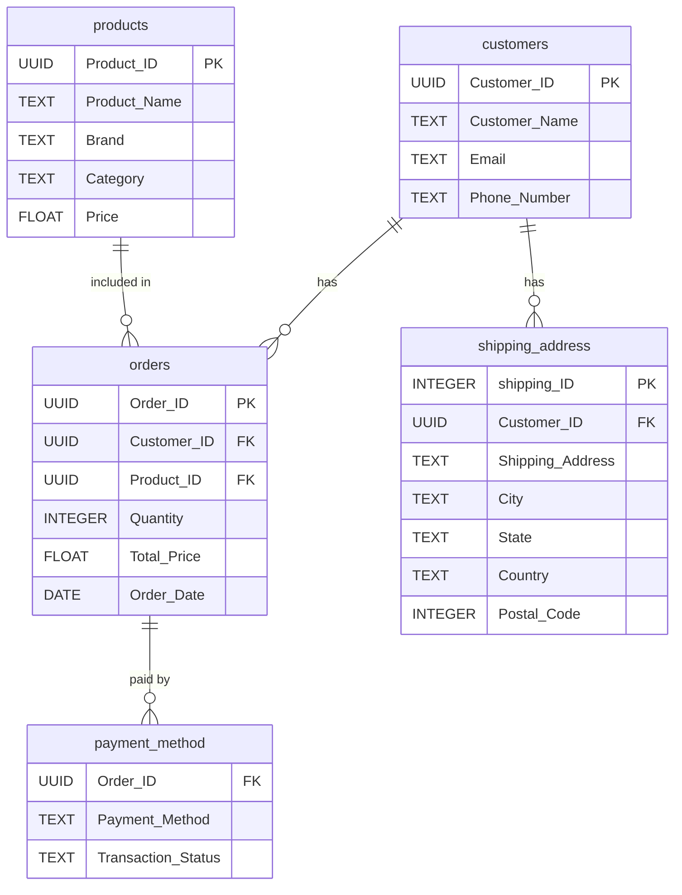

# Yanki E-commerce Data Engineering Project

## Overview

This project demonstrates a complete data engineering workflow for an e-commerce dataset using Python, PostgreSQL, and Jupyter Notebook. It covers data cleaning, normalization, schema design, and loading data into a relational database for further analytics.

## Project Structure

```
yanki-ecommerce-efl/
├── dataset/
│   ├── rawdata/
│   │   └── yanki_ecommerce.csv
│   └── cleandata/
│       ├── customers.csv
│       ├── products.csv
│       ├── shipping_address.csv
│       ├── orders.csv
│       └── payment_method.csv
├── scenarios/
│   └── case_study.md
├── .github/
│   └── workflows/
│       └── etl-schedule.yml
├── yanki_etl/
│   ├── config.py
│   ├── db.py
│   ├── logging_config.py
│   ├── main.py
│   ├── pipeline.py
│   └── schema.py
├── Dockerfile
├── docker-compose.yml
├── .dockerignore
├── Makefile
├── yanki.ipynb
├── requirements.txt
├── .env
├── .env.example
└── README.md
```

## Features

- Cleans and normalizes raw e-commerce data using pandas
- Splits data into customers, products, shipping address, orders, and payment method tables
- Uses environment variables for secure database connection
- Creates PostgreSQL schema and tables programmatically
- Loads cleaned data into PostgreSQL using psycopg2
- Modular notebook cells for each ETL step
- Includes production ETL CLI (`python -m yanki_etl.main`)
- Uses idempotent upsert-based loading for safe re-runs
- Applies configuration validation for required environment variables
- Supports containerized ETL runs with Docker and Docker Compose
- Includes daily scheduled ETL automation with GitHub Actions

## Setup Instructions

### 1. Clone the Repository

```sh
git clone https://github.com/esodevops/yanki-ecommerce-efl.git
cd yanki-ecommerce-efl
```

### 2. Install Dependencies

```sh
pip install -r requirements.txt
```

Or with Make:

```sh
make install
```

### 3. Configure Environment Variables

Create a `.env` file in the project root (recommended: copy from `.env.example`):

```sh
cp .env.example .env
```

Then update values in `.env`:

```
DB_HOST=localhost
DB_NAME=yanki_ecommerce
DB_USER=postgres
DB_PASSWORD=your_password
```

### 4. Prepare the Database

- Ensure PostgreSQL is running and accessible.
- The pipeline will create the target database and schema if they do not exist.

### 5. Run the Notebook

Open `yanki.ipynb` in Jupyter and execute the cells in order:

1. Data cleaning and normalization
2. Database connection and schema/table creation
3. Data loading into PostgreSQL

### 5B. Run Production ETL (Recommended)

Run the full ETL pipeline from terminal:

```sh
python3 -m yanki_etl.main
```

Or with Make:

```sh
make run-etl
```

Optional custom paths:

```sh
python3 -m yanki_etl.main --raw-csv dataset/rawdata/yanki_ecommerce.csv --clean-dir dataset/cleandata
```

### 5C. Run ETL with Docker

Build ETL image:

```sh
make docker-build
```

Run ETL container (uses `.env` and mounts local `dataset/`):

```sh
make docker-run
```

Run local full stack with PostgreSQL + ETL (Docker Compose):

```sh
make compose-up
```

Stop the Compose stack:

```sh
make compose-down
```

### 5D. Automated Daily ETL with GitHub Actions

The workflow at `.github/workflows/etl-schedule.yml` runs:

- Daily at 02:00 UTC
- On manual trigger (`workflow_dispatch`)

You can adjust the cron schedule in the workflow file to match your preferred time window.

### 6. Access PostgreSQL from Terminal

Use any of the following methods to connect with `psql` from your terminal.

Option A: Connect directly to the target database

```sh
psql -h localhost -U postgres -d yanki_ecommerce
```

Option B: Use environment variables from `.env`

```sh
export PGHOST=localhost
export PGUSER=postgres
export PGPASSWORD=your_password
export PGDATABASE=yanki_ecommerce
psql
```

Option C: Connect first to the default database and switch

```sh
psql -h localhost -U postgres -d postgres
\c yanki_ecommerce
```

### 7. Query the Database from Terminal

After connecting with `psql`, run these commands:

List schemas:

```sql
\dn
```

List tables in `yanki` schema:

```sql
\dt yanki.*
```

Describe a table structure:

```sql
\d yanki.customers
```

Count rows in each table:

```sql
SELECT 'customers' AS table_name, COUNT(*) FROM yanki.customers
UNION ALL
SELECT 'products', COUNT(*) FROM yanki.products
UNION ALL
SELECT 'shipping_address', COUNT(*) FROM yanki.shipping_address
UNION ALL
SELECT 'orders', COUNT(*) FROM yanki.orders
UNION ALL
SELECT 'payment_method', COUNT(*) FROM yanki.payment_method;
```

Sample reporting queries:

```sql
SELECT COUNT(*) AS total_orders, SUM(total_price) AS total_revenue
FROM yanki.orders;

SELECT payment_method, COUNT(*) AS transactions
FROM yanki.payment_method
GROUP BY payment_method
ORDER BY transactions DESC;
```

Exit `psql`:

```sql
\q
```

## File Descriptions

- `yanki.ipynb`: Main notebook with all ETL logic and database operations
- `dataset/rawdata/yanki_ecommerce.csv`: Raw input data
- `dataset/cleandata/`: Cleaned, normalized CSVs for each table
- `.env`: Environment variables for database credentials (not committed)
- `.env.example`: Safe environment template to copy for local setup
- `requirements.txt`: Python dependencies
- `scenarios/case_study.md`: Project scenario and case study
- `yanki_etl/`: Production-grade ETL package and CLI
- `Makefile`: Convenience commands for install and ETL run
- `Dockerfile`: Container image definition for ETL execution
- `docker-compose.yml`: Local orchestration for PostgreSQL + ETL
- `.github/workflows/etl-schedule.yml`: Scheduled ETL automation workflow

## Usage Notes

- The notebook is modular; you can adapt the schema or add new tables as needed.
- Production ETL uses upsert-based loading (`ON CONFLICT DO UPDATE`) for repeatable runs.
- SQL bootstrap uses `CREATE ... IF NOT EXISTS` patterns and adds useful indexes on orders.
- Use `.env.example` as a starter and keep real secrets only in `.env`.

## Production Readiness Checklist

- Environment-based configuration with required variable validation
- Structured logging for ETL execution visibility
- Automated database bootstrap (database + schema + tables + indexes)
- Idempotent data load strategy (safe re-run behavior)
- CLI entrypoint for non-notebook execution and scheduling
- Separation of concerns (config, DB, schema, pipeline, runner)
- Dockerized runtime for environment consistency
- Scheduled workflow for unattended daily execution

## License

MIT License

## Author

Sulaimon (update with your name/email if needed)

## Yanki Data Model

The data model consists of five main tables in the `yanki` schema:

- **customers**: Stores customer information (Customer_ID, Customer_Name, Email, Phone_Number)
- **products**: Stores product details (Product_ID, Product_Name, Brand, Category, Price)
- **shipping_address**: Stores shipping addresses for customers (shipping_ID, Customer_ID, Shipping_Address, City, State, Country, Postal_Code)
- **orders**: Stores order transactions (Order_ID, Customer_ID, Product_ID, Quantity, Total_Price, Order_Date)
- **payment_method**: Stores payment details for orders (Order_ID, Payment_Method, Transaction_Status)

### Entity-Relationship Diagram (ERD)



This ERD shows the relationships between the tables and their key fields. Foreign keys are indicated by `FK`, and primary keys by `PK`.
