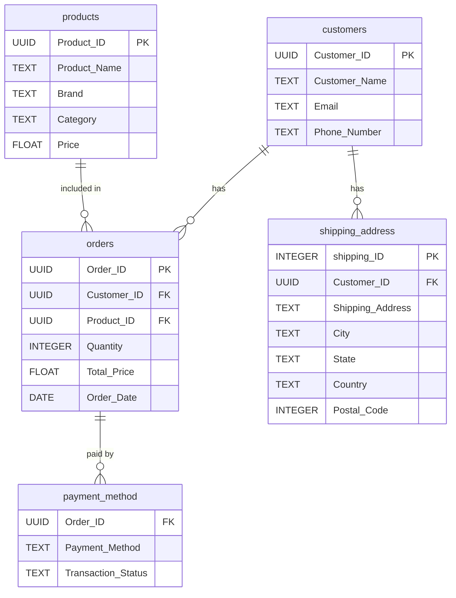

# Yanki E-commerce Data Engineering Project

## Overview

This project demonstrates a complete data engineering workflow for an e-commerce dataset using Python, pandas, and Jupyter Notebook. It covers data cleaning, normalization, and window function analytics for e-commerce data.

## Project Structure

```
yanki-window-functions/
├── dataset/
│   ├── rawdata/
│   │   └── yanki_ecommerce.csv
│   └── cleandata/
│       ├── customers.csv
│       ├── products.csv
│       ├── shipping_address.csv
│       ├── orders.csv
│       └── payment_method.csv
├── cases/
│   ├── note.md
│   └── requirements.md
├── doc/
├── tasks/
│   ├── question-1.md
│   ├── question-2.md
│   ├── solutions-1.md
│   └── solutions-2.md
├── windowcase_ENV/           # Python virtual environment
├── yanki.ipynb               # Main Jupyter notebook
├── requirements.txt          # Python dependencies
└── README.md
```

## Features

- Cleans and normalizes raw e-commerce data using pandas
- Splits data into customers, products, shipping address, orders, and payment method tables
- Provides modular notebook cells for each ETL and analytics step
- Demonstrates window functions and advanced analytics in pandas
- Includes sample questions and solutions for window function use cases

## Setup Instructions

### 1. Clone the Repository

```sh
git clone https://github.com/esodevops/yanki-window-functions.git
cd yanki-window-functions
```

### 2. Create and Activate Virtual Environment (Recommended)

```sh
python3 -m venv windowcase_ENV
source windowcase_ENV/bin/activate
```

### 3. Install Dependencies

```sh
pip install -r requirements.txt
```

### 4. Run the Notebook

Open `yanki.ipynb` in Jupyter and execute the cells in order:

1. Data cleaning and normalization
2. Data transformation and analytics (including window functions)
3. Explore solutions to the provided tasks in the `tasks/` folder

## File Descriptions

- `yanki.ipynb`: Main notebook with all ETL logic, analytics, and window function examples
- `dataset/rawdata/yanki_ecommerce.csv`: Raw input data
- `dataset/cleandata/`: Cleaned, normalized CSVs for each table
- `requirements.txt`: Python dependencies
- `cases/`: Notes and requirements for the case study
- `tasks/`: Task questions and solutions for window function exercises
- `windowcase_ENV/`: Python virtual environment (not committed)

## Usage Notes

- The notebook is modular; you can adapt the schema or add new analytics as needed.
- All data processing and analytics are performed in pandas (no database required).
- Use the provided tasks and solutions to practice window function concepts in pandas.

## Data Model

The data model consists of five main tables (as CSVs):

- **customers**: Customer_ID, Customer_Name, Email, Phone_Number
- **products**: Product_ID, Product_Name, Brand, Category, Price
- **shipping_address**: shipping_ID, Customer_ID, Shipping_Address, City, State, Country, Postal_Code
- **orders**: Order_ID, Customer_ID, Product_ID, Quantity, Total_Price, Order_Date
- **payment_method**: Order_ID, Payment_Method, Transaction_Status

### Entity-Relationship Diagram (ERD)



This ERD shows the relationships between the tables and their key fields. Foreign keys are indicated by `FK`, and primary keys by `PK`.
